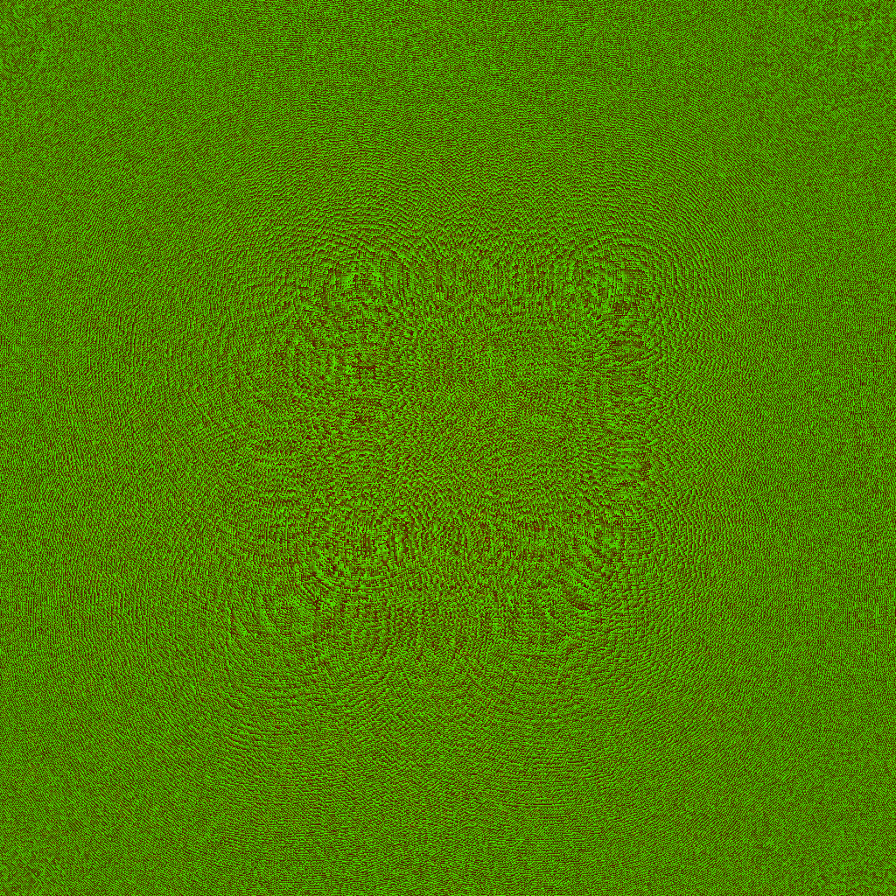
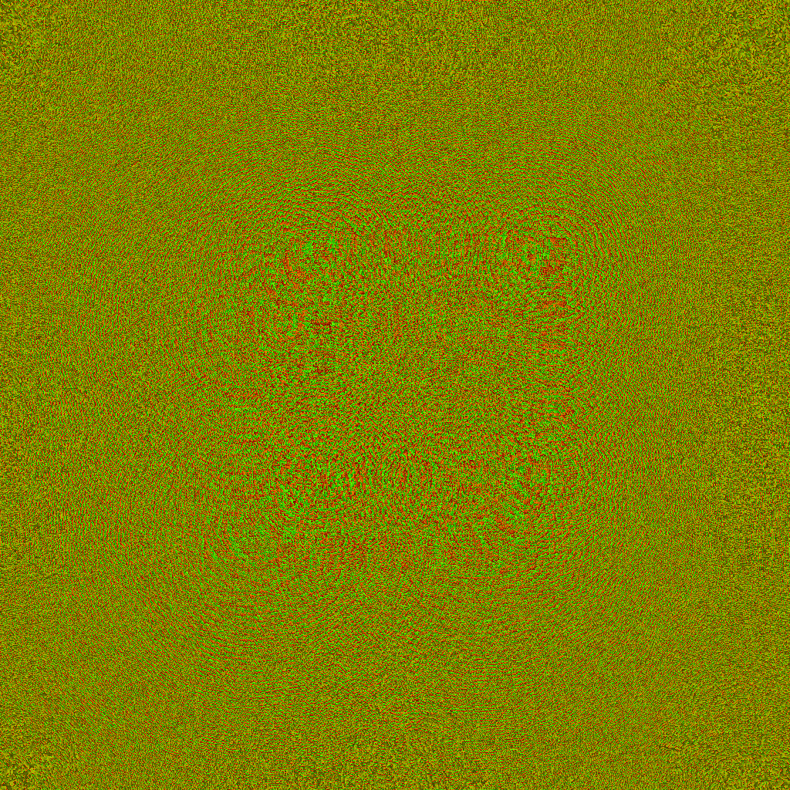

# holography_python
calculate and simulate holograms in python 
the example shows the propagation of the light from a wireframe cube 50mm to 100mm away from the modulator at a wavelength of $\lambda=638\,$nm .
The result is a complex wavefield "wavefield.npy".
This wavefield is stored for display in a 4F and RELPH setup.

The 4F setup modulates the phase with two phase modulators, where the first one modulates the phase $\phi_1$ and the second one modulates the amplitude by interference with itself and correcting the phase error with the first modulator as follows:
$\phi_2 = \pm 2 \operatorname{arccos}(ampli)$
(amplitude modulated by interference of light with itself)
$\phi_1 = \operatorname{phase}(E) - \phi_2$
(phase + phase correction for this particular amplitude modulation)
where the wavefield is reproduced according to following equation
$E = \exp(i \phi_1) \underbrace{(0.5 + 0.5*\exp(-i \phi_2))}_{\text{amplitude modulation}}$

The RELPH setup modulates the wavefield using two identical phase modulators with a phase $\phi_{1/2}$
$\phi_{1/2} = \operatorname{phase}(E) \pm \operatorname{atan}\left(\sqrt{4/|E^2|-1}\right)$
$E = \exp(i \phi_1) + \exp(i \phi_2)$

phase $\phi_1$ is encoded with a red and phase $\phi_2$ with a green color.
