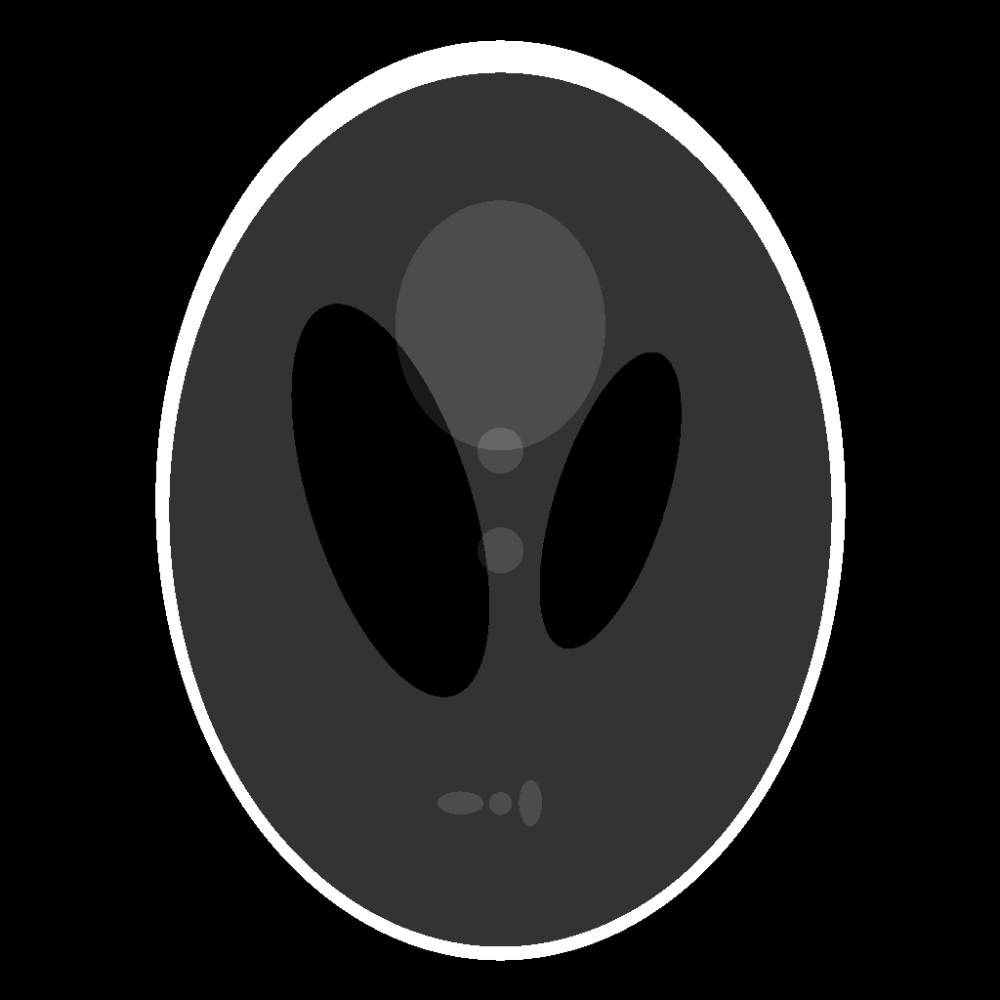

# holography_python
calculate and simulate holograms in python 
the example shows the propagation of the plane image shepp logan phantom

to a complex wavefield "wavefield.npy". 
This wavefield is stored for display in a 4F and RELPH setup.

The 4F setup modulates the phase with two phase modulators, where the first one modulates the phase $\phi$ and the second one modulates the amplitude by interference with itself and correcting the phase error with the first modulator as follows:

(amplitude modulated by interference of light with itself)

(phase + phase correction for this particular amplitude modulation)
where the wavefield is reproduced according to following equation

The RELPH setup modulates the wavefield using two identical phase modulators with a phase $\phi_{1/2}$

phase 1 is encoded with a red and phase 2 with a green color.
